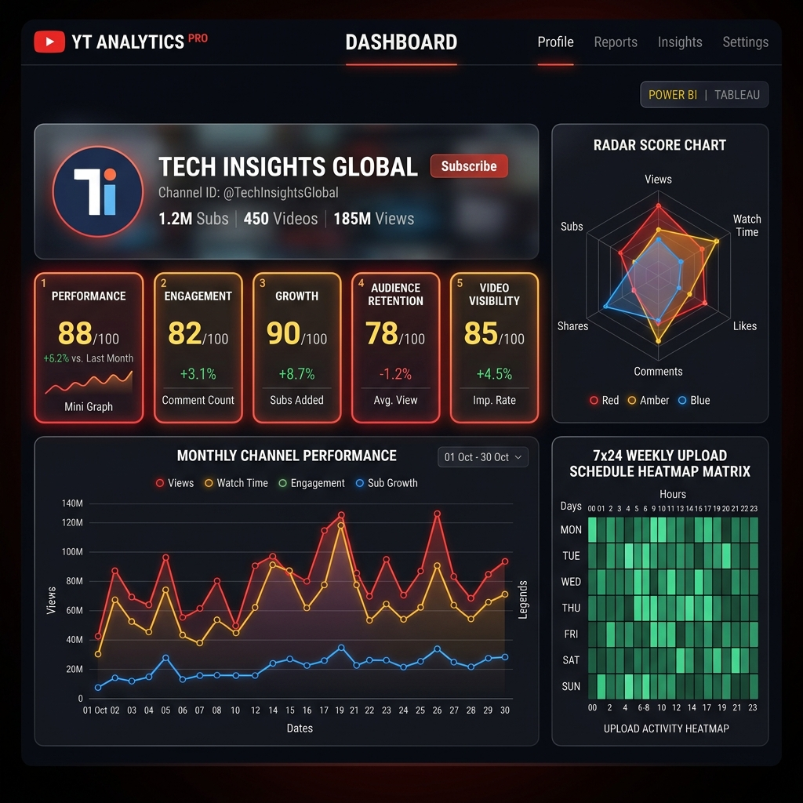

# ▶️ YouTube Engagement Analytics Studio (Power BI + Tableau)



An **Advanced YouTube Engagement Analytics Platform** powered by **YouTube Data API v3**, designed to search any YouTube channel (by `@Handle`, URL, Channel ID, or Name) and automatically compute 5 core performance scores, 7x24 posting heatmaps, AI growth recommendations, dedicated Power BI & Tableau dashboards, and multi-format dataset exports (CSV, Excel `.xlsx`, PDF).

---

## 🌟 Key Features

### 1. 🔍 Universal YouTube Channel Search & Intelligence
- Search any channel using `@Handle` (e.g., `@MrBeast`, `@mkbhd`), full URL (`youtube.com/@veritasium`), Channel ID, or Channel Name.
- Live autocomplete dropdown with instant handle suggestions and channel avatars.
- Real-time API fetching of profile logo, custom banner, creation date, country, subscribers, total views, and video counts.

### 2. 📊 5 Core Channel Scores & Radar Health Diagram
- **Overall Health Score** (0–100 scale)
- **Channel Performance Score** (Subscriber-to-view ratio & median velocity)
- **Engagement Score** (Likes + Comments relative to view benchmark)
- **Growth Score** (Upload frequency & momentum)
- **Consistency Score** (Upload interval regularity)
- **Content Quality Score** (Interaction depth)
- Visualized on an interactive **360-Degree Health Radar Chart**.

### 3. 🗓️ AI Posting Schedule & Content Strategy
- **7x24 Upload Heatmap Matrix**: Identifies peak audience interaction hours (0–23) and days of week (Mon–Sun).
- **Optimal Upload Window**: Recommends best upload day, best hour (UTC), and optimal video duration bracket (<3m, 3-8m, 8-15m, >15m).
- **Viral Video Detection**: Automatically flags videos performing >2.5x above channel baseline with a `VIRAL` badge.

### 4. 🟡 Power BI Integrated Workspace (4 Pages)
- **Page 1**: Executive Overview (KPI Tiles & Score Matrix)
- **Page 2**: Engagement Dashboard (Likes & Comments Analysis)
- **Page 3**: Video Performance (Category Share Comparison)
- **Page 4**: Growth & Upload Trends (Upload Frequency & Momentum Curves)
- **Direct Export**: Download pre-formatted Power BI `.csv` for drag-and-drop import into Power BI Desktop.

### 5. 🔵 Tableau Visual Studio
- Interactive duration vs. views vs. engagement scatter plot and category treemap view.
- **Direct Export**: Download pre-formatted Tableau `.csv` for Tableau Prep & Tableau Desktop.

### 6. 📁 Multi-Format Exporters
- **Multi-Sheet Excel Workbook (`.xlsx`)**: Overview, Video Details, Category Analytics, and Posting Schedule.
- **Power BI CSV Connector**
- **Tableau CSV Connector**
- **Executive PDF Report**: Single-click printable visual dashboard summary.

---

## 🛠️ Technology Stack

- **Backend Engine**: Python 3.13, Flask 3.1, Waitress WSGI Server, Requests, Pandas, NumPy, OpenPyXL, Python-dotenv.
- **Frontend SPA**: HTML5, Tailwind CSS, JavaScript (ES6+), Chart.js, HTML2PDF, FontAwesome.
- **Alternative Interface**: Streamlit 1.61, Plotly Express & Graph Objects.
- **Data Source**: YouTube Data API v3.

---

## 🚀 Quick Start Guide

### 1. Prerequisites
- Python 3.10+
- Active YouTube Data API v3 Key (stored in `.env`)

### 2. Environment Setup
```bash
# Clone the repository
git clone https://github.com/abhishekjadhavaids-code/Social_Media_Engagement_Dashboard.git
cd Social_Media_Engagement_Dashboard

# Create & activate virtual environment
python -m venv venv
venv\Scripts\activate   # On Windows
source venv/bin/activate # On Linux/macOS

# Install dependencies
pip install -r requirements.txt
```

### 3. Configure API Key
Create a `.env` file in the project root directory:
```env
YOUTUBE_API_KEY=your_actual_youtube_api_key_here
```

### 4. Run the Applications

#### Option A: Flask SaaS Web Studio (Production WSGI)
```bash
python dashboard/app.py
```
Open `http://127.0.0.1:5000` in your browser.

#### Option B: Streamlit Dashboard
```bash
streamlit run dashboard/streamlit_app.py
```
Open `http://localhost:8501` in your browser.

---

## 📂 Auto-Saved Local Data Directory
Searched channel datasets are automatically saved to:
`data/processed/`
- `PowerBI_<Channel>_Dataset.csv`
- `Tableau_<Channel>_Dataset.csv`
- `<Channel>_Analytics_Report.xlsx`
- `<Channel>_analytics.json`
- `powerbi_latest.csv` (Auto-refresh path for Power BI connectors)
- `tableau_latest.csv` (Auto-refresh path for Tableau connectors)

---

## 📜 License
Licensed under the [MIT License](LICENSE).
